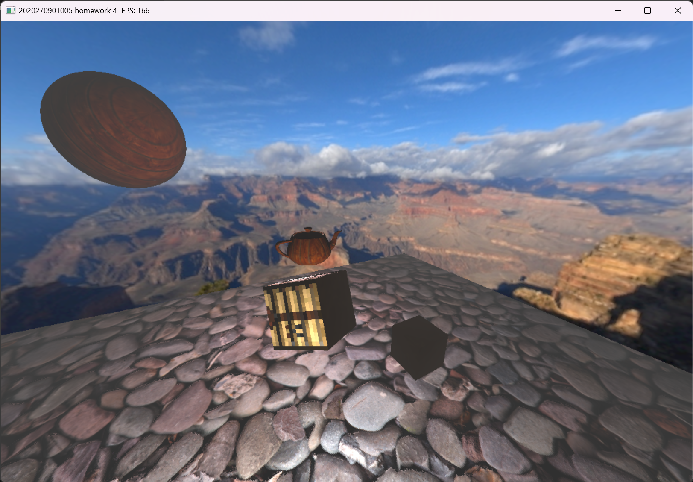

# Opengl作业和实验
2023高级计算机图像学的作业和实验代码

# 目录结构
+ /assert中为图片，场景定义等资源，另外包含**着色器源代码**
+ /bin中包含动态库方便链接，编译好的程序也输入到这里
+ /thirdparty中写了一些CMakeLists文件用于链接第三方库
+ /workspace中为所有的**C++源代码**，不同的目录表示不同的作业/实验

# 构建
直接使用CMake就行，编译器可以是clang，也支持Mingw64，MSVC应该也行
```cmake
cmake -B ./build
cmake --build ./build
```

# 运行截图

