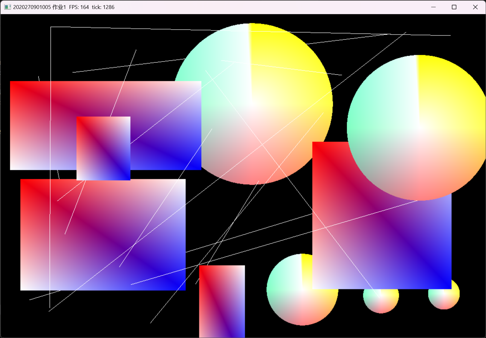
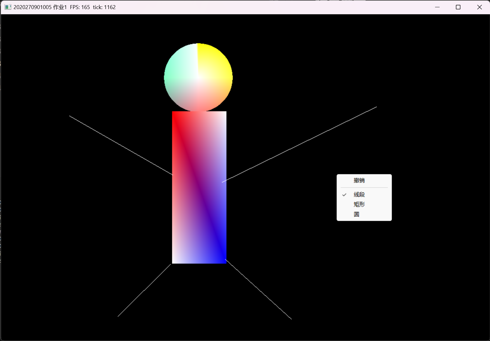

# 概述
本程序实现了
1. 使用橡皮筋方式绘制线段，方形和圆
2. 通过右键菜单选择要绘制的对象种类
3. 新绘制的图形总是遮挡旧的图形
4. 通过菜单撤销上一次绘制的图形
# 方法简述

+ 设置一个图形对象表保存所有的图形对象，并且可以通过id进行访问和删除
+ 使用橡皮擦方法，每帧都会清空画面并重绘所有的图形对象
+ 所有图形使用给定的几个顶点数组，在初始化时就生成并且不会改变，而通过设置每个图形的位置，选择，缩放（变换矩阵）以改变其位置和形状
+ 弄得非常麻烦，因为想写一个通用的程序模板，方便以后的作业

*作业相关代码在PainterSystem.h中*  
假定一个正对相机，与相机距离为z_bias的平面，作为绘制图形的“画板”      
### 在鼠标点击时  
1. 创建新的图形对象，根据选择的图形种类设置其顶点组，将其缩放设为0（不可见）
2. 将此图形对象id加入栈中
3. 通过鼠标位置计算出其在世界坐标系中对应的射线方向
4. 从相机出发沿此射线方向与“画板”求交，得到绘制图形的起点的世界坐标，保存下来
### 在鼠标拖拽时  
1. 同样计算出鼠标射线与“画板”的交点，得到绘制图形的终点坐标
2. 通过起点坐标和终点坐标计算出合适的图形位置和缩放
3. 以此设置栈顶id对应的图形对象的位置和缩放
### 在点击菜单时  
1. 如果点击撤销，则弹出栈顶id，删除对应的图形对象
2. 如果点击选择图形种类，则将此种类记录下来

+ “画板”的距离z_bias根据栈中图形的个数逐渐减小，保证新绘制的图形比旧的更近  
+ 线段，方形的顶点组直接写进const数组，生成一个100边形的顶点组作为圆形  

# 设计

全局对象：
+ GlobalRuntime：管理所有功能组件，保存一些需要全局访问的信息，方便访问

功能组件：
+ World：管理所有图形对象(GObject)，将发生更新的图形对象提交到Renderer
+ Renderer：控制渲染线程，管理资源和渲染对象(RenderItem)，每一个渲染帧前与World同步
+ Display： 控制窗口
+ MenuManager：管理弹出菜单
+ InputHandler：保存输入信息，包括键盘和鼠标
+ Clock：包括逻辑时钟和渲染时钟，分别用来控制逻辑帧频率和计算FPS
+ CommandContainer：未完成
+ system_list：保存所有的“系统”(system)，所有的具体功能（比如作业要求的功能）都实现在系统中

“系统”：
+ “系统”在逻辑帧开始前注册，在每个逻辑帧中被调用一次，系统可以通过全局对象访问所有的功能组件，并且具有独立的上下文。
+ PainterSystem：为本次作业编写的system，实现了作业要求的所有功能。
# 结果展示

# 总结
做完了，感觉不错