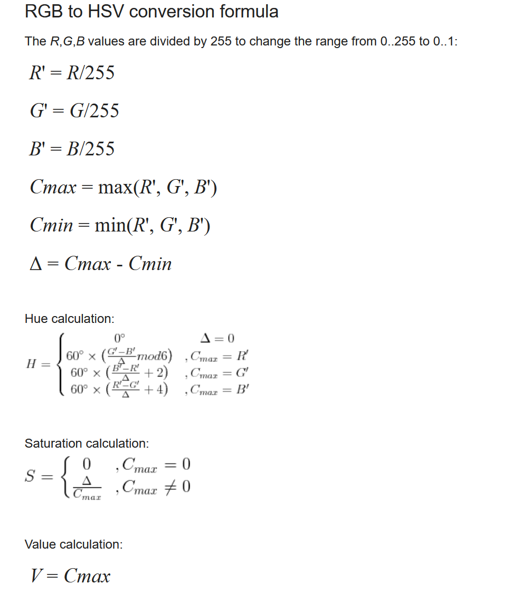
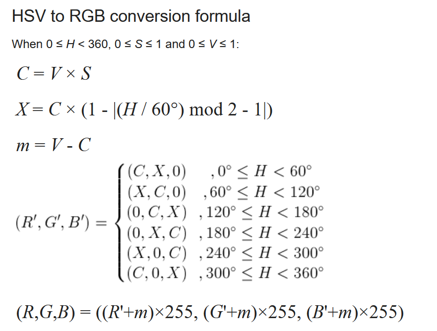
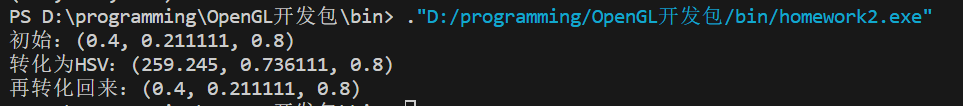

# 概述
本程序实现了
1. 将RGB空间表示的颜色转换到HSV空间
2. 将HSV空间表示的颜色转换到RGB空间
# 方法简述
  
使用了[HSV转RGB](https://www.rapidtables.com/convert/color/hsv-to-rgb.html)和[RGB转HSV](https://www.rapidtables.com/convert/color/rgb-to-hsv.html)这两个网站描述的方法进行转换。

### 网站截图RGB转HSV

### 网站截图HSV转RGB

# 结果

# 总结
就是照着网站上的算法抄的。